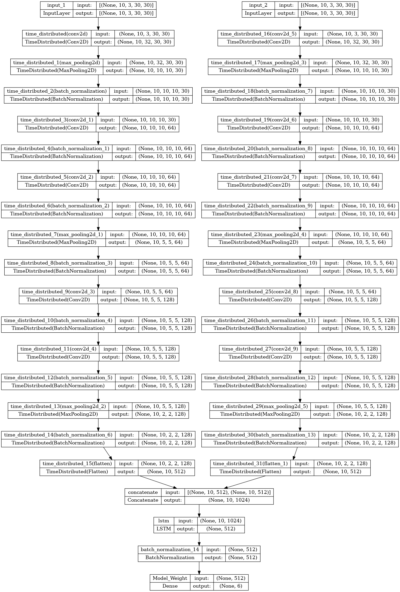

# CMPE_HAR

<div id="top"></div>

<!-- TABLE OF CONTENTS -->
<details>
  <summary>Table of Contents</summary>
  <ol>
    <li>
      <a href="#about-the-project">About The Project</a></li>
    <li>
      <a href="#getting-started">Getting Started</a></li>
    <li>
      <a href="#usage">Usage</a></li>
    <li>
      <a href="#architecture">Architecture</a></li>
  </ol>
</details>


<!-- ABOUT THE PROJECT -->
## About The Project
* Construction Management and Project Engineering
* Human Activity Recognition by IMU Sensors
<p align="right">(<a href="#top">back to top</a>)</p>

<!-- GETTING STARTED -->
## Getting Started

### Installation

1. Clone the repo
   ```sh
   git clone https://github.com/separk-1/CMPE.git
   ```
2. Install packages
   ```sh
   pip install -r requirements.txt
   ```

<!-- USAGE -->
## Usage
### Preprocessing

1. Sampling
   ```sh
   #set config_preprocessing.yaml
   python codes/preproc/sampling.py
   ```
2. Transformation
   ```sh
   #set config_preprocessing.yaml
   python codes/preproc/transformation.py
   ```
### Run

   ```sh
   #set config_CNN_LSTM.yaml
   python run/run_CNN_LSTM.py
   ```


<!-- Architecture -->
## Architecture


<p align="right">(<a href="#top">back to top</a>)</p>